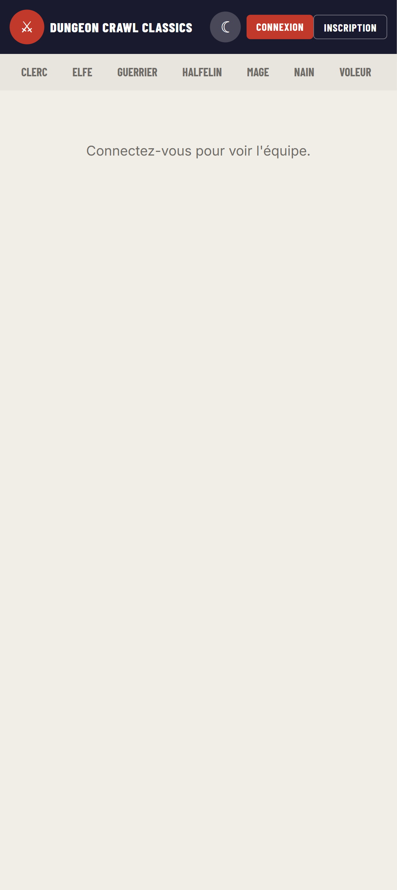
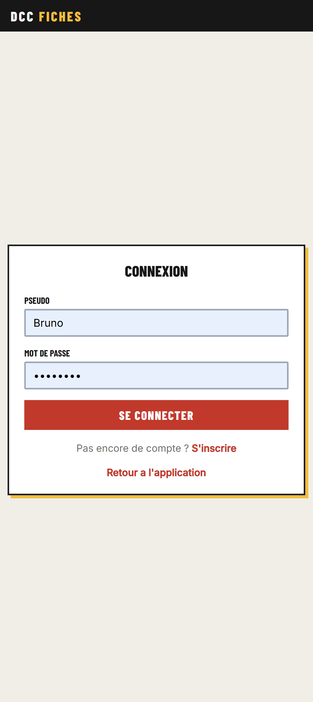
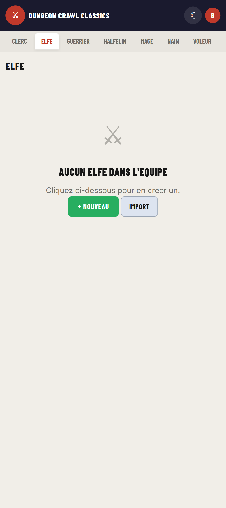
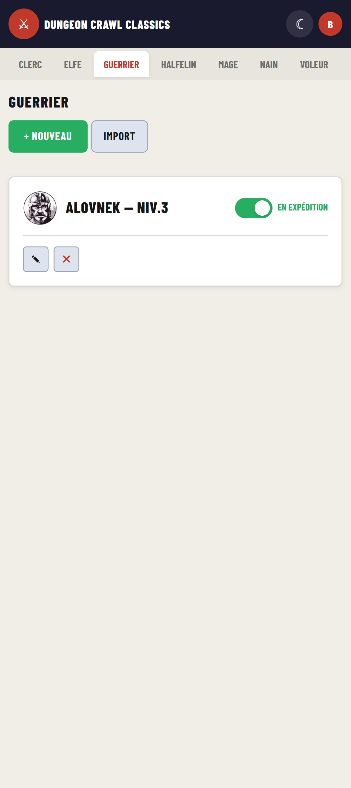
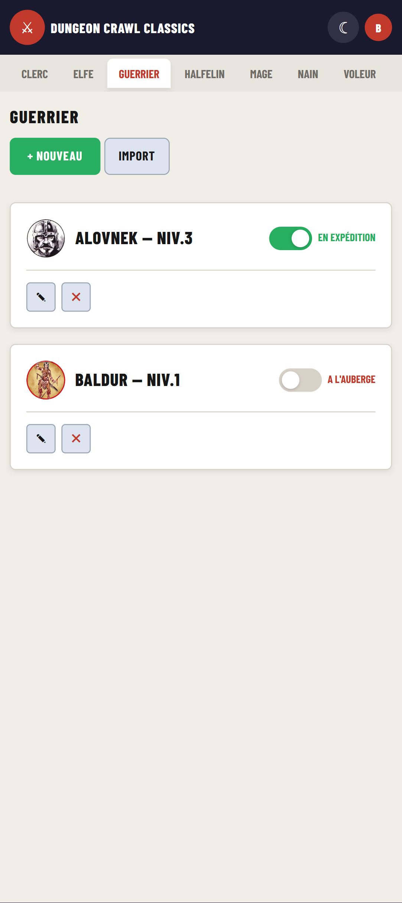
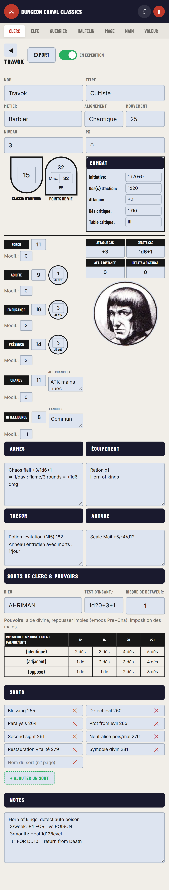
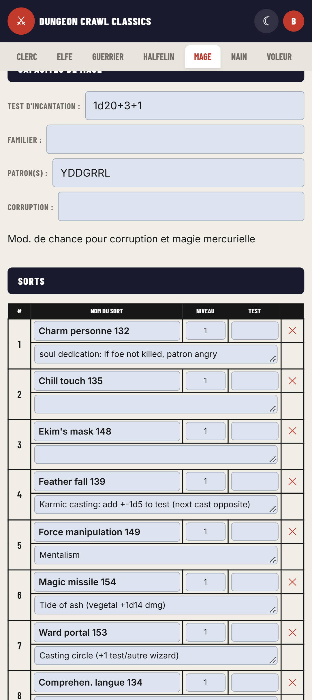
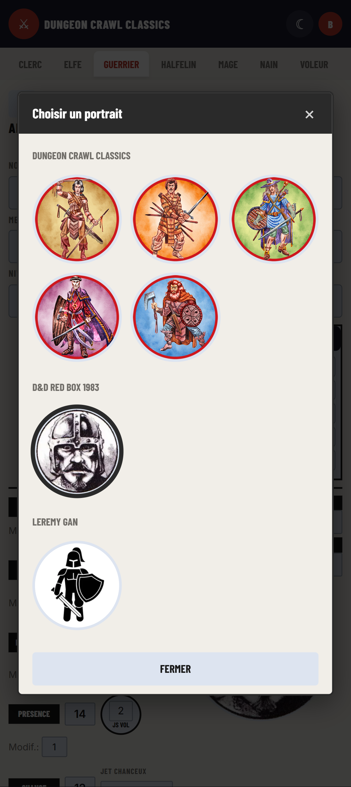
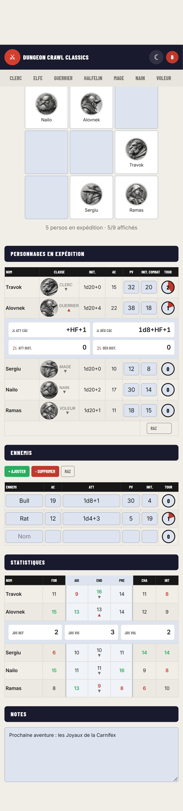
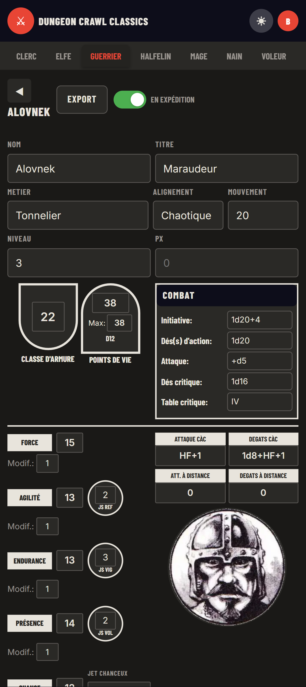

# Manuel utilisateur — DCC Fiches de Personnage

Manuel d'utilisation de l'application web **DCC Fiches de Personnage** : créez et gérez une équipe complète de personnages pour *Dungeon Crawl Classics*, suivez vos PJ en expédition et menez vos combats depuis un simple navigateur, sur ordinateur comme sur smartphone.

---

## Table des matières

1. [Présentation de l'application](#1-présentation-de-lapplication)
2. [Compte utilisateur](#2-compte-utilisateur)
3. [Découvrir l'interface](#3-découvrir-linterface)
4. [Gérer ses personnages](#4-gérer-ses-personnages)
5. [Statut : en expédition vs à l'auberge](#5-statut--en-expédition-vs-à-lauberge)
6. [La fiche de personnage](#6-la-fiche-de-personnage)
7. [Le portrait (7 sources)](#7-le-portrait-7-sources)
8. [Onglet Équipe (suivi de partie)](#8-onglet-équipe-suivi-de-partie)
9. [Personnalisation & responsive](#9-personnalisation--responsive)
10. [Astuces & dépannage](#10-astuces--dépannage)
- [Annexe A : format JSON d'export/import](#annexe-a--format-json-dexportimport)
- [Annexe B : dés de vie et portraits par classe](#annexe-b--dés-de-vie-et-portraits-par-classe)
- [Annexe C : glossaire](#annexe-c--glossaire)

---

## 1. Présentation de l'application

**DCC Fiches** est une application unique (SPA) : tout se passe dans une seule page, sans rechargement. Elle permet de :

- gérer les **7 classes** de personnages officielles de Dungeon Crawl Classics(Clerc, Elfe, Guerrier, Halfelin, Mage, Nain, Voleur) ;
- créer **zéro à plusieurs personnages** par classe ;
- remplir des **fiches fidèles aux feuilles officielles DCC** (PDF éditables fournis dans le dépôt) ;
- suivre l'**équipe en expédition** (avec possibilité de laisser des personnages à l'**auberge**) dans un tableau de combat avec ennemis et compteurs de tour ;
- choisir un **portrait** parmi 7 sources : tokens officiels DCC, illustrations D&D Red Box 1983, silhouettes Leremy Gan, portraits Shadowdark, planches Jeff Stevens, portraits Gonzo ou portraits Old School.

**Aucune installation** : l'application s'ouvre dans un navigateur moderne (Chrome, Firefox, Edge, Safari). Elle est optimisée pour smartphone mais fonctionne sur grand écran. Pour fonctionner elle nécessite seulement un serveur web avec **php** activé (et le module **sqlite3**). Voir **[README.md](./README.md)** pour plus d'informations sur le déploiement de l'application sur un serveur.

### Sauvegarde automatique

- Chaque modification d'un champ est enregistrée automatiquement après une courte pause (~0,4 s).
- Un **toast avec une icône disquette** apparaît en bas à droite quand la sauvegarde a réussi.
- Au premier chargement, le toast **« Données restaurées »** confirme le rechargement de vos fiches.
- **Conseil** : après une frappe, laissez apparaître le toast avant de fermer l'onglet.

### Sans compte

L'application est consultable sans connexion, mais aucun personnage ne peut être créé ni modifié tant que vous n'êtes pas connecté.



*L'accueil non loggé : les onglets sont visibles mais l'équipe demande une connexion.*

---

## 2. Compte utilisateur

### 2.1 S'inscrire

1. Sur l'accueil, cliquez sur **Inscription** (en haut à droite).
2. Renseignez :
   - **Pseudo** : 3 à 20 caractères (lettres, chiffres, `-` et `_` uniquement) ;
   - **Mot de passe** : 6 caractères minimum ;
   - **Confirmer** : ressaisissez le mot de passe.
3. Cliquez sur **Créer mon compte** : vous êtes redirigé vers l'application, déjà connecté.

### 2.2 Se connecter

1. Cliquez sur **Connexion** (en haut à droite de l'accueil).
2. Saisissez votre **pseudo** et votre **mot de passe**.
3. Cliquez sur **Se connecter**.



*La page de connexion. Un lien « S'inscrire » permet de créer un compte, « Retour a l'application » ramène à l'accueil.*

- En cas d'erreur, un message s'affiche en haut du formulaire.
- Déjà connecté ? Les pages de connexion/inscription vous redirigent directement vers l'application.

### 2.3 Menu utilisateur

Une fois connecté, votre **avatar** (la première lettre de votre pseudo) remplace les boutons Connexion/Inscription.

**Mode opératoire — ouvrir le menu** : cliquez sur l'avatar. Le menu propose :

| Action | Effet |
|---|---|
| **Bienvenue {pseudo}** | En-tête du menu |
| **Exporter tout (JSON)** | Télécharge tous vos personnages **et vos notes d'équipe** dans un fichier |
| **Importer tout (JSON)** | Remplace **tous** vos personnages (et vos notes, si le fichier en contient) par ceux d'un fichier |
| **Changer le mot de passe** | Ouvre le formulaire de changement (§ 2.4) |
| **Supprimer le compte** | Suppression définitive (§ 2.5) |
| **Deconnexion** | Ferme la session et renvoie à la page de connexion |

Le menu se referme en cliquant ailleurs ou en appuyant sur **Échap**.

### 2.4 Changer son mot de passe

1. Ouvrez le **menu utilisateur** (clic sur l'avatar).
2. Cliquez sur **Changer le mot de passe**.
3. Dans la fenêtre qui s'ouvre, remplissez les 3 champs :
   - **Mot de passe actuel** (vérifié par le serveur) ;
   - **Nouveau mot de passe** (6 caractères minimum) ;
   - **Confirmer le nouveau mot de passe**.
4. Cliquez sur **Valider**.

Erreurs signalées en rouge dans la fenêtre : champs vides, moins de 6 caractères, confirmation différente, nouveau mot de passe identique à l'ancien, ancien mot de passe incorrect. À la réussite, un toast **« Mot de passe changé »** apparaît.

Pour annuler : **Annuler**, un clic en dehors de la fenêtre, ou la touche **Échap**.

### 2.5 Supprimer son compte

1. Ouvrez le **menu utilisateur**.
2. Cliquez sur **Supprimer le compte** (en rouge).
3. Confirmez dans l'avertissement **« Toutes vos donnees seront perdues. Cette action est irreversible. »**

Tous vos personnages sont supprimés avec le compte : vous êtes redirigé vers la page de connexion. **Pensez à un export JSON (§ 4.6) avant de supprimer votre compte.**

### 2.6 Sans compte

- Les onglets de classes affichent **« Connectez-vous pour gérer vos personnages. »**
- L'onglet Équipe affiche **« Connectez-vous pour voir l'équipe. »**
- Le bouton **+ Nouveau** n'apparaît pas : rien n'est enregistrable.

---

## 3. Découvrir l'interface

### La barre supérieure (topbar)

- **Bouton ⚔** : ouvre l'onglet **Equipe** — affiché uniquement en basse résolution (≤ 600 px), où l'onglet lui-même est masqué.
- **Texte « Dungeon Crawl Classics »**
- **Bouton ☾ / ☀** : bascule le thème sombre/clair (§ 9).
- **Avatar** : menu utilisateur (une fois connecté) — ou boutons **Connexion / Inscription** sinon.


### La barre d'onglets

8 onglets : **Equipe** (rouge, en premier et en haut) puis en dessous les 7 classes : **Clerc, Elfe, Guerrier, Halfelin, Mage, Nain, Voleur**.

> En basse résolution (≤ 600 px), l'onglet **Equipe** est masqué : on y accède par l'**icône ⚔** (haut gauche de la barre supérieure).

- L'onglet actif est **mémorisé** dans le navigateur : à votre prochaine visite, c'est lui qui s'ouvre.
- Cliquer sur un onglet charge aussitôt la liste des personnages de cette classe.

### Les trois états d'un onglet de classe

**État 1 — vide** (aucun personnage créé) :



*L'état vide propose **+ Nouveau** (créer) et **Import** (charger un fichier JSON).*

**État 2 — liste de cartes** (au moins un personnage) :



*Chaque carte affiche le nom, le niveau et l'interrupteur de statut. Le bouton **+ Nouveau** en haut crée un personnage supplémentaire.*

**État 3 — fiche** : la feuille complète du personnage (§ 6). L'état vide ou la liste s'ouvre automatiquement selon le nombre de personnages actifs (§ 4.2).

### Éléments transverses

- **Popups de confirmation** : fenêtres personnalisées avec **OK / Annuler** (ou **Supprimer** en rouge). Fermeture par clic en dehors ou touche **Échap** — jamais de boîte de dialogue native.
- **Spinner** : si le chargement dépasse 0,5 s, un cercle animé s'affiche jusqu'à la fin.
- **Toasts** : petits messages en bas à droite (disquette = sauvegarde réussie, « Import reussi », « Erreur sauvegarde », etc.).

---

## 4. Gérer ses personnages

### 4.1 Créer un personnage

1. Ouvrez l'onglet de la classe voulue (ex. **Guerrier**).
2. Cliquez sur **+ Nouveau** (en haut de la liste, ou dans l'écran vide).
3. La fiche s'ouvre immédiatement sur un personnage **« Sans nom »**, créé en base et placé par défaut **en expédition**.
4. Renseignez le champ **Nom** : c'est lui qui donne son titre à la carte dans la liste (il est aussi utilisé pour nommer les exports).
5. Remplissez le reste de la fiche — la sauvegarde est automatique (§ 4.8).

### 4.2 Ouvrir et fermer une fiche

**Ouvrir** :
- cliquez n'importe où sur la carte, ou
- cliquez sur le bouton **✎** (stylo) de la carte.

**Ouvrir automatiquement** : si l'onglet ne contient **qu'un seul personnage actif**, sa fiche s'ouvre toute seule quand vous changez d'onglet.

**Revenir à la liste** : cliquez sur la flèche **◀** en haut à gauche de la fiche. L'interrupteur de statut reste utilisable sans quitter la fiche.

### 4.3 Supprimer un personnage

1. Dans la liste, cliquez sur **✖** de la carte concernée (rouge au survol).
2. Confirmez dans la popup **« Supprimer "…" ? »** en cliquant sur **Supprimer**.

La suppression est définitive. Pour conserver une copie, exportez d'abord le personnage (§ 4.4).

### 4.4 Exporter un personnage (JSON individuel)

1. Ouvrez la fiche du personnage.
2. Cliquez sur **Export** (en haut, à côté du nom).
3. Un fichier `.json` est téléchargé, nommé d'après le personnage (ex. `Alovnek.json`).

Le fichier contient la classe, le nom, le statut et **toutes les données de la fiche**, y compris le portrait choisi.

### 4.5 Importer un personnage (JSON individuel)

1. Ouvrez l'onglet de la **classe cible** (le fichier doit contenir une classe valide).
2. Cliquez sur **Import** (en haut de la liste, ou dans l'écran vide).
3. Sélectionnez le fichier `.json`.
4. Le personnage est créé et sa fiche s'ouvre ; un toast confirme.

- En cas de fichier invalide (classe manquante, JSON illisible), une popup explique l'erreur.
- L'import **ajoute** un personnage : il ne remplace rien.

### 4.6 Export / Import global (tous vos personnages)

**Exporter toute la collection** :
1. Ouvrez le **menu utilisateur** (avatar).
2. Cliquez sur **Exporter tout (JSON)**.
3. Un fichier `dcc-persos-AAAA-MM-JJ.json` est téléchargé, contenant **tous** vos personnages **et vos notes d'équipe**.
4. Si vous n'avez aucun personnage, une popup le signale.

**Importer une collection** :
1. Menu utilisateur → **Importer tout (JSON)**.
2. Sélectionnez le fichier (format de l'[annexe A](#annexe-a--format-json-dexportimport)).
3. Le fichier est validé (présence d'au moins un personnage, classe de chacun).
4. Confirmez l'avertissement **« Cela remplacera tous vos personnages actuels. Cette action est irreversible. »** (bouton rouge).
5. **Tous** vos personnages actuels sont supprimés, puis le contenu du fichier est recréé ; un toast annonce le nombre importé.
6. Si le fichier contient le champ **`team_notes`** (même vide), vos **notes d'équipe** sont remplacées par son contenu ; les anciens exports, dépourvus de ce champ, **laissent vos notes actuelles intactes**.

> **Usage recommandé** : l'export global sert de **sauvegarde externe** régulière et de transfert entre deux navigateurs/machines — fiches **et** notes d'équipe.

### 4.7 Ordre d'affichage des cartes

Dans une liste, les cartes sont triées ainsi :
1. les personnages **en expédition** d'abord ;
2. puis par **date de dernière modification** (les plus récents en premier).

La carte affiche `NOM — Niv.X` si un niveau est renseigné, le **portrait** du personnage à gauche de son nom, et pour les Clercs, le nom du dieu en sous-titre.

### 4.8 Comment fonctionne la sauvegarde automatique

1. Vous modifiez un champ de la fiche.
2. Après ~**0,4 s** sans nouvelle frappe (anti-rafale), l'ensemble des champs de la fiche est envoyé au serveur.
3. Le toast **disquette** confirme (les toasts sont eux-mêmes espacés d'environ 0,6 s).
4. En cas d'échec : toast **« Erreur sauvegarde »** → rechargez la page et vérifiez votre connexion (§ 10).

Le champ **Nom** de la fiche met à jour le titre de la carte dans la liste. Les boutons de statut, eux, sont enregistrés immédiatement.

---

## 5. Statut : en expédition vs à l'auberge

Chaque personnage a un statut binaire, simple à comprendre :

| Statut | Signification | Conséquences |
|---|---|---|
| **EN EXPÉDITION** (interrupteur ON, vert) | Le PJ fait partie de la mission | Présent dans le tableau de l'**onglet Équipe** ; candidat à l'ouverture automatique de fiche ; affiché en premier dans la liste |
| **A L'AUBERGE** (interrupteur OFF, rouge) | Le PJ reste au repos | **Absent** de l'onglet Équipe ; trié après les actifs dans la liste |

**Aucun personnage n'est jamais supprimé** par ce basculement : à l'auberge signifie simplement « inactif pour l'instant ».

### Mode opératoire — changer le statut

Deux endroits, même effet immédiat :

**Depuis la liste des cartes** :
1. Repérez l'interrupteur en haut à droite de la carte.
2. Cliquez dessus : le libellé passe de **EN EXPÉDITION** (vert) à **A L'AUBERGE** (rouge) ou inversement.
3. Le changement est enregistré sur-le-champ (toast disquette).

**Depuis la fiche** :
1. Ouvrez la fiche.
2. Utilisez l'interrupteur situé en haut, à droite du bouton **Export**.
3. Le libellé change sans quitter la fiche.



*Exemple : Alovnek (Niv.3) est **en expédition**, Zaruma (Niv.2) est **à l'auberge**. Seul Alovnek apparaîtra dans l'onglet Équipe.*

---

## 6. La fiche de personnage

Toutes les fiches partagent un **bloc commun** (page 1 + équipement) et ajoutent ensuite leurs **sections de classe**.

### 6.1 Anatomie commune — illustrée par le Clerc



*La fiche de Travok, Clerc niveau 3 — vue d'ensemble sur mobile (défilement vertical).*

**En-tête de fiche**
- **◀** : retour à la liste.
- **Nom du personnage** : titre courant.
- **Export** : export JSON individuel (§ 4.4).
- **Interrupteur** : statut expédition/auberge (§ 5).

**Identité** : Nom, Titre, Métier, Alignement, Mouvement, Niveau, PX.
> Le champ **Nom** renomme la carte dans la liste.

**Défense**
- **Bouclier** : Classe d'armure (CA).
- **Casque** : Points de vie, **Max** des PV, et le **dé de vie** de la classe affiché automatiquement : d12 (Guerrier), d10 (Nain), d8 (Clerc), d6 (Elfe, Voleur, Halfelin), d4 (Mage).

**Encadré Combat** : Initiative, Des(s) d'action, Attaque, Dés critique, Table critique.

**Caractéristiques (6 stat-blocks)** : Force, Agilité, Endurance, Présence, Chance, Intelligence — chacune avec sa valeur et son **Modif.**
- Cercles **JS Ref** (Agilité), **JS Vig** (Endurance), **JS Vol** (Présence) : jets de sauvegarde.
- **Jet chanceux** (Chance) et **Langues** (Intelligence) : zones de texte redimensionnables.

**Combat étendu** (à droite) : Attaque CAC, Dégâts CAC, Att. à distance, Dégâts à distance.

**Portrait** : sous le combat étendu — voir § 7.

**Équipement** : zones **Armes**, **Équipement**, **Trésor**, **Armure** (texte libre multi-lignes).

### 6.2 Spécificités de chaque classe

Chaque classe ajoute une page de capacités puis une section **Notes** :

| Classe | Sections propres |
|---|---|
| **Clerc** | Dieu, Test d'incant., Risque de défaveur, rappel des pouvoirs, table **Imposition des mains** (référence non modifiable — décalage d'alignement, colonnes 12/14/20/22+), **liste de sorts dynamique** sur 2 colonnes (§ 6.3) |
| **Elfe** | Test d'incantation, Familier, Patron(s), Corruption, **Traits elfiques** (rappel), Autres notes, **liste de sorts dynamique** (2 sorts de patron figés en lignes 1-2, lignes libres à partir de la 3e, même présentation que le Mage : § 6.3) |
| **Guerrier** | Coup critique sur, Arme soumise au mod. de Chance, Hauts faits d'armes (dé) |
| **Halfelin** | Infravision, Discrétion, Porte-bonheur, Petite taille/lenteur + encadré **Combat à deux armes** (d16+d16, crit sur 16, etc.) |
| **Mage** | Test d'incantation, Familier, Patron(s), Corruption, mod. de chance, **liste de sorts dynamique** (§ 6.3) |
| **Nain** | Infravision, Compétences souterraines, Arme Chance, Hauts faits d'arme, Coup de bouclier |
| **Voleur** | Grille de **14 compétences** (Dé de chance, Falsifier documents, Attaque sournoise, Se déguiser, Déplacement silencieux, Lire langues inconnues, Se cacher dans l'ombre, Utiliser des poisons, Vol à la tire, Incant. parchemin, Escalade parois abruptes, Crocheter les serrures, Détecter les pièges, Désamorcer les pièges) + Argot des voleurs |

### 6.3 Gérer les sorts du Mage, de l'Elfe et du Clerc (liste dynamique)

Les listes de sorts du Mage (2 lignes par sort), de l'Elfe (2 lignes par sort + 2 sorts de patron figés) et du Clerc (grille **2 colonnes**, un champ par sort) s'adaptent au nombre de sorts appris.



*Chaque sort occupe deux lignes : nom / niveau / test / suppression en haut, effet et notes en dessous. Le nom du sort s'affiche en gras.*

**Ajouter un sort**
1. Cliquez sur **+ Ajouter un sort** sous la table.
2. Une ligne vide numérotée s'ajoute à la fin (toujours une ligne disponible).
3. Remplissez Nom, Niveau (1-5), Test, puis Effet/Notes : la sauvegarde est automatique.

**Supprimer un sort**
1. Cliquez sur le **✕** rouge à droite du sort.
2. Si le sort contient déjà du texte, confirmez dans la popup **« Supprimer ce sort ? »** (bouton **Supprimer**). Une ligne vide est supprimée sans confirmation.
3. Les sorts sont **renumérotés automatiquement** ; il reste toujours au moins une ligne vide.

**Côté Elfe**
- Les 2 premières lignes sont **figées** : *Lier un patron* et *Invoquer un Patron* (2 lignes chacune, comme les autres sorts) — elles n'ont ni bouton ✕ ni champs modifiables, à l'exception du blanc **`___ /jour`** d'*Invoquer un Patron*.
- Les lignes libres commencent à la **3e position** : les sorts ajoutés/supprimés sont numérotés à partir de 3.

**Côté Clerc**
- Grille de **2 colonnes** : chaque cellule = 1 sort (`n°` + champ unique « Nom n° de page » + ✕).
- Chaque **ligne** (2 cellules) est délimitée par des bordures et un **fond alterné** (zébrage).
- Les sorts saisis dans l'ancienne grille 3 × 7 sont **migrés automatiquement** à l'ouverture (ordre de lecture actuel conservé).

> Les classes sans liste de sorts (Guerrier, Halfelin, Nain, Voleur) n'affichent pas cette section.

---

## 7. Le portrait (7 sources)

Chaque fiche possède un portrait, sous le bloc « combat étendu ». **Cliquez dessus** pour ouvrir la fenêtre de sélection.

Sept sources sont disponibles :

| Source | Contenu |
|---|---|
| **Dungeon Crawl Classics** | Tokens officiels DCC (20 au total, répartis par classe) |
| **D&D Red Box 1983** | Illustrations classiques noir et blanc (1 par classe) |
| **Leremy Gan** | Silhouettes d'archetype (1 par classe) |
| **Shadowdark** | Portraits (12 au total, répartis par classe) |
| **Jeff Stevens** | Planches de comics (8 au total, répartis par classe) |
| **Gonzo** | Portraits colorés + variantes noir et blanc (30 au total, répartis par classe) |
| **Old School** | Portraits Old School Révival (17 au total, répartis par classe) |

### 7.1 Choisir un portrait (mode opératoire)

1. Ouvrez la fiche, cliquez sur le portrait.
2. La popup **« Choisir un portrait »** s'ouvre : grille continue de portraits ronds (3 colonnes, 2 sur mobile), le **nom de chaque source** s'affiche **au-dessus du premier portrait** de cette source.
3. Le portrait courant est **surligné** (bordure accent) et la liste s'y **défile automatiquement**.
4. Cliquez sur une image : la popup se ferme, l'image et le choix sont **sauvegardés automatiquement** (toast disquette).
5. Pour annuler : bouton **✕** (en-tête), bouton **FERMER** (pied), clic en dehors de la fenêtre, ou touche **Échap**.



*La popup de choix : grille continue (3 colonnes) ; le libellé de chaque source (DCC, Red Box, Leremy Gan, Shadowdark, Jeff Stevens, Gonzo, Old School) apparaît au-dessus du premier portrait de la section. Le portrait courant est cerclé de la couleur d'accent.*

### 7.2 Où le portrait apparaît

- Dans la **liste des cartes** : à gauche du nom, même taille que dans l'onglet Équipe.
- Dans l'onglet **Équipe** : colonne **Classe**.
- La source et l'index choisis sont enregistrés **dans la fiche** : ils survivent à la déconnexion et suivent l'export/import JSON (§ 4.4, [annexe A](#annexe-a--format-json-dexportimport)).

---

## 8. Onglet Équipe (suivi de partie)

L'onglet **Equipe** (premier onglet, fond rouge) est le tableau de bord de vos parties : il liste tous les personnages **en expédition** de vos 7 classes et sert de initiative tracker pendant le combat.

**Accès** :
- **écran large** : onglet **Equipe** dédié (premier onglet, fond rouge) ;
- **basse résolution / mobile (≤ 600 px)** : l'onglet est masqué — utilisez l'**icône ⚔** ronde en haut à gauche de la barre supérieure ;
- connexion obligatoire, sinon message « Connectez-vous pour voir l'équipe. ».



### 8.1 Tableau des personnages en expédition

Colonnes :

| Colonne | Contenu | Modifiable ? |
|---|---|---|
| **Nom** | Nom du PJ (portrait + classe dans la colonne voisine) | Clic = **ouvre la fiche** du personnage (l'onglet de sa classe s'ouvre d'abord) |
| **Classe** | Portrait + nom de classe (+ chevron) | Clic = **déplier le détail combat** (§ 8.1b) |
| **Init.** | Initiative lue dans la fiche | Non (éditez-la dans la fiche) |
| **AC** | Classe d'armure lue dans la fiche | Non (éditez-la dans la fiche) |
| **PV** | Points de vie | **Oui** : la valeur est **synchronisée vers la fiche** du PJ (toast disquette) |
| **Init. combat** | Initiative d'ordre de combat | Oui, mais **non enregistrée** (remise à zéro au rechargement) : usage de combat ponctuel |
| **Tour** | Compteur de tour visuel (§ 8.2) | Oui (§ 8.2) |

> Seuls les PJ **en expédition** apparaissent. Pour en retirer un, passez-le à l'auberge depuis sa classe (§ 5) puis rechargez l'onglet.

### 8.1b Détail combat dépliable

Cliquez sur la **colonne Classe** (portrait + libellé, chevron ▼) d'un personnage pour **déplier** sous sa ligne les stats de combat de sa fiche :

```
⚔ Att CàC    ⚔ Dég CàC
🏹 Att Dist.  🏹 Dég Dist.
```

- Un **seul** personnage est ouvert à la fois ; re-cliquez (chevron ▲) pour replier.
- Les valeurs sont lues en temps réel dans la fiche (combat étendu) ; un champ non renseigné affiche **`-`**.
- Clavier : **Entrée** ou **Espace** sur la colonne Classe (focus visible, `aria-expanded`).
- Le **Nom** reste cliquable pour ouvrir la fiche complète (comportement inchangé).

### 8.2 Compteur de tour

Un cercle par ligne (PJ et ennemis) qui se remplit visuellement par paliers de **20 %**.

**Mode opératoire** :
- **Clic / tap sur le cercle** : +1.
  - 0 = vide → 1 = 20 % → 2 = 40 % → 3 = 60 % → 4 = 80 % → 5 = plein → 6 = 20 % … (cycle modulo 5).
- **Remise à zéro** :
  - ordinateur : **clic droit** sur le cercle ;
  - mobile : **appui long** (~0,5 s) sur le cercle.

Les compteurs servent à suivre les rounds ; ils ne sont pas enregistrés (repartent à 0 au rechargement).

### 8.3 Gérer les ennemis

Sous la section **Ennemis** : un tableau de **3 lignes vides par défaut**, colonnes dans l'ordre **Ennemi, AC, ATT, PV, Init., Tour** (AC et Init. étroits — 2 chiffres ; ATT large).

- **+ Ajouter** : ajoute une ligne en fin de tableau.
- **− Supprimer** : supprime la **dernière** ligne.
- **RAZ** : vide le tableau et le réinitialise à **3 lignes vides**.

> Les ennemis et leurs valeurs sont **éphémères** : ils servent au combat en cours et disparaissent au rechargement. Les compteurs de tour fonctionnent comme pour les PJ (§ 8.2).

### 8.4 Notes d'équipe

- Zone de texte libre sous l'en-tête **Notes** : plan de session, butin à partager, rappels de règles…
- **Sauvegarde automatique** (pause ~0,6 s, toast disquette ; « Erreur sauvegarde » en cas d'échec).
- Stockées **dans la base de données de votre compte** : elles vous suivent sur **tous vos appareils** et sont **inclues dans l'export global JSON** / restaurées par l'import global (§ 4.6).

---

## 9. Personnalisation & responsive

### Thème clair / sombre

1. Cliquez sur le bouton **☾** (thème sombre) / **☀** (thème clair) dans la topbar.
2. Le thème s'applique aussitôt **à toute l'application** et est **mémorisé** dans le navigateur (y compris sur les pages de connexion).



*Le thème sombre sur la fiche d'Alovnek : fond noir, champs gris clair, libellés blancs.*

Si le thème ne « tient » pas après un rechargement : videz le cache du navigateur, puis réappliquez-le une fois (§ 10).

### Ce que le navigateur mémorise localement

| Donnée | Clé / emplacement | Transférée avec un export ? |
|---|---|---|
| Thème | localStorage | Non |
| Onglet actif | localStorage | Non |
| Fiches de personnages | **Base de données serveur** | Oui (export JSON) |
| Notes d'équipe | **Base de données serveur** | Oui (export JSON) |

### Comportement mobile (< 600 px)

- Fiches : mise en page compacte sur 2 colonnes maintenues, cercles de jets réduits, textes redimensionnables.
- Tableaux de l'onglet Équipe : lignes et portraits réduits pour tenir en largeur d'écran.
- **Règle générale** : l'application se pilote aussi au doigt (clics → taps, clic droit → appui long).

---

## 10. Astuces & dépannage

### Les signes visuels

| Signal | Signification | Que faire |
|---|---|---|
| Toast **disquette** | Sauvegarde réussie | Rien |
| Toast **« Données restaurées »** | Chargement initial terminé | Rien |
| Toast **« Erreur sauvegarde »** | Envoi échoué (réseau/serveur) | Rechargez la page, vérifiez la connexion ; rechargez ensuite la fiche pour vérifier les dernières valeurs |
| Toast **« Import reussi (N persos) »** | Import terminé | Vérifiez les onglets |
| Spinner prolongé | Serveur lent | Patientez ; en cas de blocage, rechargez |
| Message **« Erreur de chargement. »** dans un onglet | Session expirée ou serveur injoignable | Reconnectez-vous (§ 2.2) puis rechargez |

### Sessions et connexion

- La session est **maintenue vivante automatiquement** (ping toutes les 5 minutes tant que l'onglet reste ouvert).
- Si vous restaurez le navigateur longtemps après ouverture, reconnectez-vous : les boutons d'auth de la topbar réapparaissent alors en mode invité.
- **Déconnexion** : menu utilisateur → **Deconnexion** (retour à la page de connexion).

### Sauvegarder vos données hors ligne

1. Menu utilisateur → **Exporter tout (JSON)**.
2. Conservez le fichier `dcc-persos-….json` (clé USB, autre machine…) : il contient vos personnages **et** vos notes d'équipe.
3. Pour restaurer : **Importer tout (JSON)** sur le compte cible (remplacement complet, § 4.6).

Les exports **individuels** (bouton **Export** des fiches) servent au transfert d'un PJ précis entre comptes : réimportez-les depuis **Import** dans l'onglet de la bonne classe.

### Problèmes courants

- **Mes modifications ne sont pas conservées** : attendez le toast disquette avant de fermer ; vérifiez la console (F12) et que le serveur PHP/SQLite fonctionne (côté administration du dépôt, voir README).
- **Le thème régresse au rechargement** : le thème vit dans le localStorage ; videz le cache, réactivez-le une fois.
- **Les notes d'équipe sont vides sur un autre appareil** : vérifiez d'abord la connexion au bon compte ; en cas de doute, restaurez-les depuis un **Exporter/Importer tout (JSON)** (§ 4.6). Les notes d'un ancien navigateur sont migrées automatiquement en base à la première ouverture de l'onglet Équipe.
- **Un personnage n'apparaît pas dans l'Équipe** : vérifiez son interrupteur **EN EXPÉDITION** (§ 5), puis rouvrez l'onglet.
- **Je ne trouve plus l'onglet Équipe** : en basse résolution (≤ 600 px) il est masqué — utilisez l'**icône ⚔** en haut à gauche (§ 8).
- **Import global refusé** : le fichier doit contenir au moins un personnage et une `class` valide pour chacun (annexe A).
- **Pseudo/mot de passe refusé** : pseudo 3-20 caractères (`a-z A-Z 0-9 - _`), mot de passe 6+ ; une ancienne session peut rester active → rechargez la page.

---

## Annexe A : format JSON d'export/import

### Personnage individuel (bouton Export / Import)

```json
{
  "version": 1,
  "class": "guerrier",
  "name": "Alovnek",
  "is_active": 1,
  "data": {
    "nom": "Alovnek",
    "titre": "Maraudeur",
    "niveau": "3",
    "classe_armure": "22",
    "points_de_vie": "38",
    "max_pv": "38",
    "portrait_source": "dcc",
    "portrait_index": "1"
  }
}
```

- `class` est **obligatoire** à l'import (sinon refus) : `clerc`, `elfe`, `guerrier`, `halfelin`, `mage`, `nain`, `voleur`.
- `data` contient tous les champs de la fiche (textes bruts).
- `portrait_source` vaut `dcc`, `redbox`, `shadow` (Leremy Gan), `shadowdark`, `comics` (Jeff Stevens), `gonzo` ou `osr` (Old School) ; `portrait_index` est la position de l'image dans la source (§ 7).

### Collection globale (Exporter tout / Importer tout)

```json
{
  "version": 1,
  "exported_at": "2026-09-22T18:00:00.000Z",
  "team_notes": "Session 3 : descendedre dans les catacombes, garder la potion pour Travok.",
  "characters": [
    { "name": "Travok", "class": "clerc", "is_active": 1, "data": { "nom": "Travok", "dieu": "AHRIMAN" } },
    { "name": "Sergiu", "class": "mage", "is_active": 1, "data": { "nom": "Sergiu" } }
  ]
}
```

- `characters` : **tableau non vide**, chaque entrée avec au minimum `class`.
- `team_notes` : notes d'équipe (texte libre, **champ optionnel**).
- L'import **remplace intégralement** la collection existante (après confirmation).
- Fichier **sans** `team_notes` (anciens exports) : les notes actuelles sont **conservées** ; fichier **avec** `team_notes` (même vide) : les notes sont **remplacées**.

---

## Annexe B : dés de vie et portraits par classe

| Classe | Dé de vie (affiché dans le casque) | Portraits DCC | Red Box | Leremy Gan | Shadowdark | Jeff Stevens | Gonzo | Old School |
|---|---|---|---|---|---|---|---|---|
| Clerc | d8 | 2 | 1 | 1 | 2 | 2 | 4 | 2 |
| Elfe | d6 | 2 | 1 | 1 | 2 | 1 | 6 | 4 |
| Guerrier | **d12** | **5** | 1 | 1 | 2 | 1 | **2** | 1 |
| Halfelin | d6 | 2 | 1 | 1 | 1 | 1 | 4 | 2 |
| Mage | **d4** | **4** | 1 | 1 | 1 | 1 | 4 | 3 |
| Nain | d10 | 2 | 1 | 1 | 1 | 1 | 6 | 3 |
| Voleur | d6 | 3 | 1 | 1 | **3** | 1 | 4 | 2 |
| **Total** | — | **20 tokens** | **7 illustrations** | **7 silhouettes** | **12 images** | **8 planches** | **30 images** | **17 images** |

- La sélection se fait via la popup **« Choisir un portrait »** (§ 7) : les sept sources y sont proposées, libellé au-dessus du premier portrait de chaque section.

---

## Annexe C : glossaire

| Terme | Signification |
|---|---|
| **CA / Classe d'armure** | Classe d'armure, valeur de défense (bouclier de la fiche) |
| **PV / Points de vie** | Points de vie (casque de la fiche), avec PV Max |
| **Dé de vie** | Dé de caractéristique de la classe (d4 à d12) |
| **PX** | Points d'expérience |
| **JS Ref / Vig / Vol** | Jets de sauvegarde : Réflexes, Vigueur, Volonté |
| **Init.** | Initiative (jet d'entrée en combat) |
| **Init. combat** | Colonne éphémère d'ordre de combat (onglet Équipe) |
| **CAC** | Corps à corps |
| **HFA** | Hauts faits d'armes (Guerrier, Nain) |
| **Critique / Table critique** | Zone et table de confirmation des coups critiques |
| **Risque de défaveur** | Jauge de défaveur divine (Clerc) |
| **Corruption** | Jauge de corruption magique (Elfe, Mage) |
| **En expédition** | Statut actif : le PJ figure dans l'onglet Équipe |
| **À l'auberge** | Statut inactif : le PJ reste en retrait (jamais supprimé) |
| **Tour** | Compteur de round visuel (cycle modulo 5, remplissage 20 %) |
| **DCC** | *Dungeon Crawl Classics* — tokens de portraits officiels |
| **Red Box** | Illustrations classiques D&D (Basic/Red Box 1983), noir et blanc |
| **Leremy Gan** | Source de portraits silhouette, 1 image par classe |
| **Shadowdark** | Source de portraits, 12 images réparties par classe |
| **Jeff Stevens** | Planches de comics, 8 images réparties par classe |
| **Gonzo** | Portraits colorés + variantes N&B, 30 images réparties par classe |
| **Old School** | Portraits OSR, 17 images réparties par classe |
| **Toast** | Petit message transitoire en bas à droite |
| **RAZ** | Remise à zéro (table des ennemis) |

---

*Manuel de l'utilisateur — DCC Fiches de Personnage. Toutes les captures citées se trouvent dans le dossier [`captures/`](captures/).*
