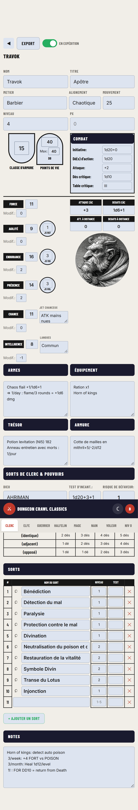
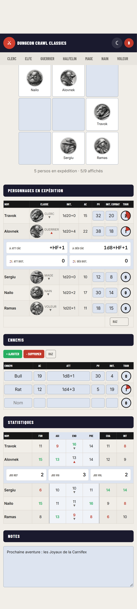
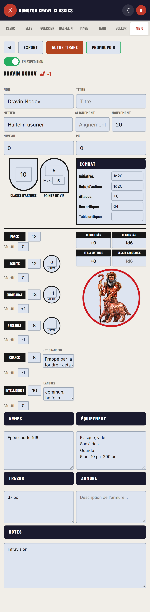
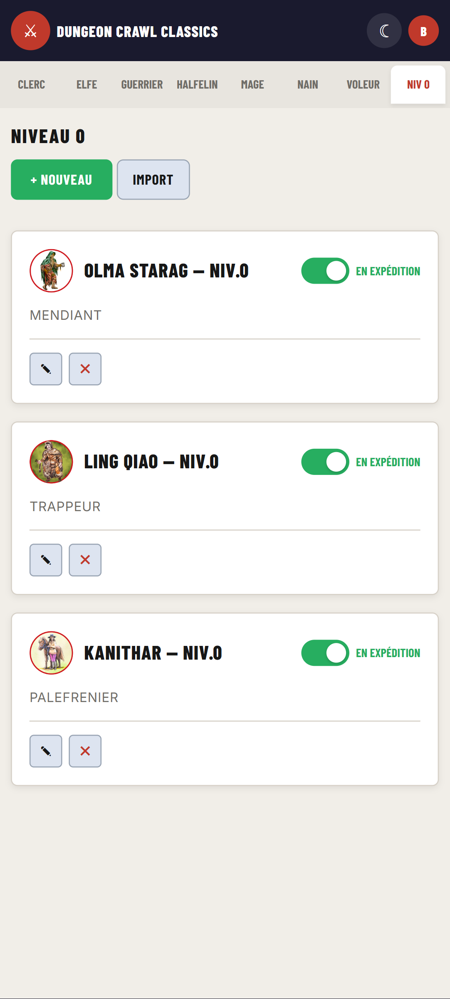
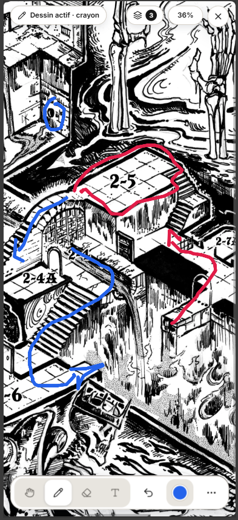
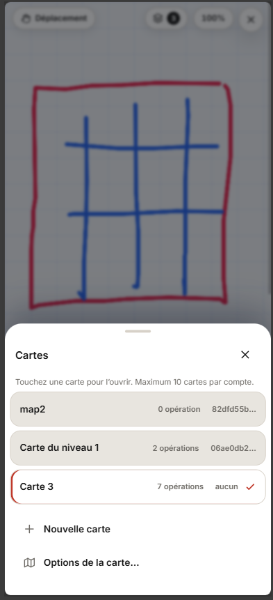

# DCC Fiches de Personnage

Application web SPA pour gerer une equipe complete de personnages pour Dungeon Crawl Classics (DCC). Responsive, optimisee pour smartphone.
Manuel d'utilisation consultable dans **[MANUAL.md](./MANUAL.md)**

| Fiche Clerc | Onglet Equipe |
|:-----------:|:-------------:|
|  |  |

| Fiche Niveau 0 | Onglet Niveau 0 |
|:--------------:|:---------------:|
|  |  |

| Module Carte (mobile) | Tiroir des calques |
|:---------------------:|:------------------:|
|  |  |

## Fonctionnalites

### Authentification
- Connexion / Inscription / Deconnexion
- Changement de mot de passe (verification de l'ancien mot de passe)
- Suppression de compte (avec confirmation, supprime les personnages et la session)
- Sessions securisees (bcrypt, regeneration de session)
- Heartbeat automatique (ping toutes les 5 min)
- Redirection automatique selon l'etat de connexion
- Menu utilisateur (avatar + dropdown)

### Gestion des personnages
- 8 onglets de personnages : les 7 classes **Clerc, Elfe, Guerrier, Halfelin, Mage, Nain, Voleur** + l'onglet **Niveau 0** (funnel)
- 0 a plusieurs personnages par classe
- Creation rapide (bouton "+ Nouveau")
- Import / Export individuel au format JSON
- Import / Export global (tous les personnages + notes d equipe d un coup)
- **10 fiches pre-generees** fournies dans `pregens/` (module *Jungle Tomb of the Mummy Bride*) au format **Import JSON individuel** (§ 4.5 du manuel)
- Suppression avec confirmation custom (modal)
- Toggle "En expedition" / "A l'auberge" (statut actif/inactif)
- Cartes de personnages avec **portrait**, nom, niveau, et toggle

### Fiches de personnage
- **Commun** : Identite (Nom, Titre, Metier, Alignement, Mouvement, Niveau, PX), Defense (CA, PV/Max avec **Des de vie**), Combat (Initiative, Des d'action, Attaque, Critique), 6 carac. avec modif. et jets de sauvegarde, Combat etendu (CAC/Distance), **Portrait** (7 sources, choix via popup), Equipement (Armes, Equipement, Tresor, Armure)
- **Clerc** : Dieu, Incantation, Defaveur, Imposition des mains (tableau de référence non modifiable), **Liste de sorts dynamique** (table comme le Mage : 1 ligne par sort = n°, nom, niveau, test, suppression, ajout/suppression avec confirmation, niveau et test sauvegardés, migration de l'ancienne grille 3 × 7)
- **Elfe** : Incantation, Familier, Patron, Corruption, Traits elfiques, **Liste de sorts dynamique** comme le Mage (2 sorts de patron figés en lignes 1-2 : Lier un patron / Invoquer un Patron (___/jour) saisissable, lignes libres à partir de la 3e, ajout/suppression avec confirmation)
- **Guerrier** : Coup critique, Arme Chance, Hauts faits d'armes
- **Halfelin** : Infravision, Discretion, Porte-bonheur, Combat a deux armes
- **Mage** : Incantation, Familier, Patron, Corruption, **Liste de sorts dynamique** (ajout/suppression de lignes avec confirmation, nom en gras, style editable)
- **Nain** : Infravision, Competences souterraines, Coup de bouclier, Arme Chance
- **Voleur** : 14 competences voleur en grille (De de chance, Escalade, Crocheter, Pieges, etc.)
- **Sorts (Mage, Elfe, Clerc)** : **meme table** pour les 3 classes (colonnes N°, Nom, Niveau, Test, Suppression) ; le **nom du sort se lit en gras 14 px**, la note (Mage/Elfe, 1 ligne sous le sort) en 11 px gris secondaire ; le Clerc n'a **pas de ligne de note** et sauvegarde desormais Niveau + Test par sort (cles `sort_niveau_N` / `sort_test_N`, vides si absentes a la lecture)

### Niveau 0 (funnel)
- Onglet **« Niveau 0 »** apres *Voleur* ; en mobile (<= 600 px) il reste visible sous la forme courte **« Niv 0 »** : les 8 onglets occupent toute la largeur (`flex: 1`, ellipsis si besoin) **sans defilement horizontal** ; seul l'onglet Equipe est masque au profit de l'icone ⚔
- **Fiche simplifiee** : BLOC_COMMUN + Notes, **sans le de de vie** dans le bouclier PV (les niveaux 0 n'ont pas de de de vie)
- **« + Nouveau » = tirage aleatoire complet** (table `plan0/` generee dans `lvl0-data.js`) : nom, metier (arme + equipement), 6 caracs en 3d6, modifs, CA 10 + mod AGI, PV 1d4 + mod END (plancher 1), initiative `1d20` + mod AGI, jet chanceux, langues, notes raciales, equipement (3 objets + metier), trésor 5d12 pc, portrait tire selon le metier (`funnel-icons.js`) ; la fiche s'ouvre ensuite directement
- **`Autre tirage`** : relance un tirage complet et remplace le personnage ouvert (pour refuser un tirage) — présent **uniquement pendant la session de tirage**, c'est-à-dire à la création (**+ Nouveau**) puis tant qu'on ne quitte pas la fiche ; dès le retour à la liste, un changement d'onglet ou l'ouverture d'un autre personnage, le bouton disparaît
- **`Promouvoir`** : modale de choix de classe - classe raciale imposée si le metier **commence par** `elfe` / `nain` / `halfelin`, sinon choix parmi Clerc, Guerrier, Mage, Voleur ; case « supprimer le personnage de niveau 0 apres la conversion » (fausse par defaut) ; creation du niveau 1 en recopiant la fiche **entierement** (JS, attaque, des/table de critique, alignement, armure compris) - **seul le portrait est retire** (tire pour la classe) - puis ouverture directe de la nouvelle fiche
- **Edition identique** aux autres onglets (auto-save, export/import individuel et global, supression, toggle expedition/auberge) ; un niveau 0 en expedition apparait dans l'**onglet Equipe** (PV, initiative, tour, ordre de marche)
- Carte : 1re ligne de metier (a la place du dieu), nom suivi de `— Niv.0`
- **Puissance** : dans l'en-tete de la fiche **uniquement** (a droite du nom), icone de bras muscule en rouge + somme des modificateurs des 6 carac (ex. `+3`) - repere rapide sur la qualite du tirage (`DCCLvl0Roll.powerOf`)

### Definition des sorts (dossier frere dcc-spells-reader)
- **Detection automatique** : au demarrage, chargement de `../dcc-spells-reader/content/anchors.js` (1 requete = presence du dossier frere + index des ancres) ; si le dossier est absent ou non accessible HTTP, **aucune icone n'apparait** et la fiche reste identique (aucun PHP, aucune configuration)
- **Loupe a gauche de chaque nom de sort renseigne** (Mage, Elfe, Clerc ; ligne vide = pas d'icone) ; sur les lignes fixes de l'Elfe : loupe sur *Lier un patron*, **loupe + loupe patron** sur *Invoquer un Patron* (lit le champ « Patron(s) » au moment du clic)
- **Plusieurs patrons dans « Patron(s) »** : la loupe rouge ouvre d'abord une **petite fenetre de selection** listant les patrons saisis, puis la description de celui clique (separateurs `;`, `/`, `+`, ` et ` — la virgule ne separe **jamais**, certains noms de patrons en contiennent) ; une saisie inconnue reste affichee en grise et declenche la modale **« Patron introuvable »** ; un seul patron : ouverture directe, inchangee
- **Popup plein ecran** dans le theme de la fiche : texte HTML complet du sort (stats, description, table de resultats), **defilement infini** (haut + bas, plages 127-303 / 322-356, trou 304-321 saute), demarrage sur le sort clique ; bouton « page scannee » masque
- **Nom ignore le numero de page** (`Boule de feu 203`), accents/casse/spaces sans importance, singulier/pluriel et petites fautes de frappe toleres ; echec → modale **« Sort introuvable »** (verifier le nom du sort)
- **Noms en anglais** : `../dcc-spells-reader/spell-translation.js` (module ES lu en texte, 130 paires FR/EN) traduit la saisie avant resolution — la popup ouvre le **titre francais** du livre et affiche le **nom anglais saisi en sous-titre** ; fichier absent ou erreur reseau → comportement precedent, inchange (1 seule requete `fetch`, memorisee)
- Fermeture : bouton X ou touche Echap ; suite `09-spell-reader` (143 assertions) + smoke sur les donnees reelles (144/144 noms resolus, 130/130 traductions FR et EN sans divergence de page)

### Portrait
- 8 sources d'images : **DCC** (tokens officiels, 20 images), **D&D Red Box 1983** (7 illustrations), **Leremy Gan** (7 silhouettes), **Shadowdark** (12 images), **Jeff Stevens** (8 planches), **Gonzo** (30 images), **Old School** (17 images) et **Funnel - niveau 0** (75 tokens `icons/funnel-tokens/`, catalogue `funnel-icons.js`)
- **Popup « Choisir un portrait »** : clic sur le portrait dans la fiche → grille continue (3 colonnes, 2 sur mobile), libellé de source au-dessus du premier portrait de chaque section
- **Dossiers absents : pas de 404** (`portrait-guard.js`) : si le dossier d'une source n'est pas present sur le serveur (licence / copyright), la source entiere n'apparait pas dans la popup (1 requete lazy `api/icons.php` mise en cache par session ; echec de l'endpoint → affichage complet, comportement historique) et **partout ou un portrait s'affiche** (fiche, cartes de la liste, onglet Equipe, ordre de marche) un **placeholder** « Aucune image disponible » (silhouette SVG inline, dimensions conservees) remplace l'image → **aucune requete, aucun 404**, choix du joueur conserve en base ; si la grille du selecteur est vide, message explicite (niveau 0 : « portraits non installes ... droits d'image »)
- Portrait courant surligne (bordure accent) et scroll automatique vers lui
- Fermeture : bouton X, bouton Fermer, clic en dehors, ou touche Echap
- Choix sauvegarde avec le personnage en base, propage dans les imports/exports JSON individuels et globaux
- Affiche aussi dans les **cartes de la liste** (a gauche du nom) et dans l'**onglet Equipe** (colonne Classe)
- **Crane rouge (PV <= 0)** : overlay "tete de mort" pose au dessus du portrait quand les PV courants sont <= 0 — fiche, cartes de la liste (expedition **et** auberge), onglet Equipe (colonne Classe **et** grille d'ordre de marche) ; il disparait des que les PV repassent au dessus de 0

### Onglet Equipe
- **Ordre de marche** (section repliable en haut) : grille 3x3 (portraits + noms, 9 persos max) ; drag & drop unifie souris (clic maintenu) / tactile (appui long ~0,4 s) ; case vide = deplacement, case occupee = echange instantane ; sauvegarde immediate en base + auto-reparation (doublon / id perdu → reconstruction gauche→droite) ; inclus dans l'export/import JSON (`marching_order`)
- Tableau des personnages en expedition avec **icone de portrait** dans la colonne Classe (100% hauteur de ligne)
- Nom cliquable (**ouvre la fiche**), nom trop long **tronque avec ...** (infobulle = nom complet), Init, AC, PV editables, Init combat et **Compteur de tour visuel** (remplissage circulaire par 20%) — **etat combat sauvegarde en base** (debounce 600 ms)
- **Detail combat depliable** : clic sur la colonne Classe (chevron sous le libelle) → ligne de stats sous le personnage (Att/Degats Cac + Att/Degats distance) ; un seul perso ouvert a la fois ; valeur vide = tiret
- **Bouton RAZ** sous les colonnes Init. combat + Tour (avec confirmation) : efface les init. combat, remet les compteurs a zero et **propage la remise a zero en base**
- Synchronisation des PV vers la fiche du personnage
- Tableau des **Statistiques** (entre Ennemis et Notes) : FOR AGI END PRE CHA INT, **vert = max / rouge = min** de colonne (texte seul, ex æquo inclus)
  - **Nom cliquable** = ouvre la fiche du personnage (comme le tableau des PJ en expédition)
  - Zone **AGI–END–PRE** groupée + **chevron sous END** → detail des jets de sauvegarde (REF / VIG / VOL) juste sous la ligne
  - Un seul detail JdS ouvert ; collapse independant du detail combat
- Tableau des ennemis : colonnes **Ennemi, AC, ATT, PV, Init., Tour** (ajout/suppression/RAZ avec confirmation) — **sauvegarde en base, seules les lignes renseignees sont conservees**
- Compteurs de tour (clic = +1, clic droit / appui long = reset, cycle modulo 5) — **sauvegardes en base**
- **Etat combat en base** : Init. combat, tours et ennemis sont ecrits dans `users.team_state` (debounce 600 ms + toast), restaurs au prochain affichage et **inclus dans l'export/import global JSON** (`team_state`, remap des index vers les nouveaux ids ; fichier ancien sans le champ = remise a zero)
- Notes d'equipe (sauvegardees en base via l'API, inclues dans l'export/import global JSON)
- L'onglet Equipe n'est **recharge qu'une fois** par session ; a chaque retour sur l'onglet, les valeurs persos (nom, initiative, AC, PV, details, stats) sont **resynchronisees sur place** depuis la base, l'**etat combat** (Init. combat / compteurs / ennemis) affiche est conserve car il est deja en base ; **rechargement complet de la page** si la composition change (create / delete / toggle / import) — l'etat combat est alors relu en base ; PV synchronises bidirectionnellement Equipe <-> fiche ouverte

### Module Carte (dessin de carte)
- Page de dessin **plein ecran** ouverte par l'icone `carte` de la topbar (a gauche de l'icone de theme, utilisateur connecte), fermee par une croix ou Echap
- Meme outillage que l'application `draw-on-map` : **crayon, gomme, texte, deplacer, annuler**, palette de 6 couleurs, zoom (boutons / curseur / 100 % / ajuster / **pincement** / **reglette verticale permanente sur PC**, masquee sur tactile), multi-cartes (calques), mode focus
- Dessin **vectoriel** (traits/gomme/texte en unites de scene, epaisseur = ecran/zoom), rendu canvas transparent au-dessus de l'image
- **Grille infinie** sans image de fond : la scene grandit pour toujours couvrir la vue (visible + 1 ecran de reserve) et le dessin — la grille remplit l'ecran a tout zoom ; « Ajuster a l'ecran » cadre le dessin (ou l'image de fond si presente), 100 % si carte vide
- **Images de fond** png/jpg/jpeg/webp : converties en **webp**, stockees `data/maps/[UID].webp` (UID unique genere a chaque import), servies par `api/map-image.php` (session obligatoire) ; nom d'origine conserve en base et dans les exports (ni affiche ni modifiable dans l'interface), remplacement (ancien fichier supprime) et suppression effective ; une carte encore nommee « Carte N » est **rebaptee du nom du fichier** (sans extension)
- **Sauvegarde automatique** pendant le dessin (toast disquette) ; outil/couleur/taille et **zoom/position par carte** restaures a la reouverture
- **10 cartes maximum** par compte (message d'erreur invitant a supprimer un calque)
- **Export/Import par calque** (JSON `v:3` avec UID du fond, portant sur le **calque actif** : l'import remplace son dessin) ou **global** (`Exporter tout` / `Importer tout`) : JSON seul, ou **ZIP** (JSON + `images/<uid>.webp`) des qu'un fond existe ; image introuvable a l'import = toast d'erreur + grille par defaut, dessin conserve
- Suppression d'une carte = suppression de son image de fond (si plus referencee)
- Suites `15-map-draw` (122 assertions), `16-map-persist` (34), `17-map-export` (32)

### Sauvegarde automatique
- Debounce 600ms sur tous les champs modifiables
- Toast de confirmation (icone disquette) a chaque sauvegarde
- Toast "Donnees restaurees" au chargement
- Toast sur modification des PV et notes d'equipe

### Navigation
- Onglets avec persistence de l'onglet actif (localStorage)
- Auto-ouverture de la fiche si 1 seul personnage actif
- Bouton retour (fleche) pour revenir a la liste
- Onglet Equipe dedie sur grand ecran ; sur ecran reduit (<= 600px), icone Equipe dans le topbar + barre d'onglets a largeur maximale (libelle court « Niv 0 », pas de defilement horizontal)

### UI / UX
- Theme sombre / clair (localStorage)
- Popups custom (alert / confirm) au lieu de alert() natifs
- Spinner de chargement (affiche apres 500ms si chargement lent)
- Design responsive (breakpoint 600px)
- Favicon SVG (epees croisees + de)
- Formes CSS (bouclier pour CA, casque pour PV, cercles pour jets)

## Structure

```
dcc-sheet/
├── index.html                  # SPA principale
├── test.bat                    # Lanceur Windows des tests de non-regression
├── script.js                   # Gestionnaire central (tabs, auth, CRUD, auto-save, nav, portraits)
├── spell-reader.js             # Definition des sorts (detection dcc-spells-reader, resolution, popup plein ecran)
├── style.css                   # Styles principaux (themes, layout, responsive, portraits)
├── style-auth.css              # Styles des pages d'authentification
├── favicon.svg                 # Favicon SVG
├── dcc-icons.js                # Catalogue d'icones DCC (20 tokens, 7 classes)
├── dd-red-box-icons.js         # Catalogue d'icones D&D Red Box (7 images, 7 classes)
├── shadow-icons.js             # Catalogue d'icones Leremy Gan (7 silhouettes, 7 classes)
├── shadowdark-icons.js         # Catalogue d'icones Shadowdark (12 images, 7 classes)
├── comics-icons.js             # Catalogue d'icones Jeff Stevens (8 planches, 7 classes)
├── gonzo-icons.js              # Catalogue d'icones Gonzo (30 images, 7 classes)
├── osr-icons.js                # Catalogue d'icones Old School (17 images, 7 classes)
├── portrait-icons.js           # Registre des sources de portraits (getPortraitSrc)
├── funnel-icons.js             # Catalogue de portraits niveau 0 (75 tokens + metier -> images)
├── lvl0-data.js                # Donnees niveau 0 generees (noms, metiers, jets chanceux, equipements)
├── lvl0-roll.js                # Moteur de tirage niveau 0 (pur : mods, race, arme, promotion)
├── marching-order.js           # Logique pure ordre de marche (normalize, export, import)
├── team-state.js               # Logique pure etat combat equipe (init, tours, ennemis, export, import)
├── dead-overlay.js             # Overlay "tete de mort" sur les portraits (PV courants <= 0)
├── portrait-guard.js           # Placeholder « aucune image disponible » si un dossier de portraits est absent (optionnel)
├── map-draw.js                 # Module Carte : dessin de carte plein ecran (port de draw-on-map, persistance BDD)
├── api/
│   ├── db.php                  # SQLite3 + helpers (users, characters, session)
│   ├── auth.php                # Authentification (login, register, logout, change_password, delete_account)
│   ├── characters.php          # CRUD personnages (list, get, create, save, set_active, delete)
│   ├── maps.php                # Calques de cartes (CRUD, prefs, export ZIP, import JSON/ZIP, check_images)
│   ├── map-image.php           # Images de fond des cartes (upload webp, service, suppression) -> data/maps/[UID].webp
│   └── icons.php               # Dossiers de portraits presents sur le serveur (action=list)
├── classes/
│   ├── bloc_commun.js          # Bloc commun + portrait (identite, combat, stats, portrait, equipement)
│   ├── clerc.js                # Fiche Clerc (sorts dynamiques, table 1 ligne par sort)
│   ├── elfe.js                 # Fiche Elfe (sorts dynamiques + 2 sorts de patron figés)
│   ├── guerrier.js             # Fiche Guerrier
│   ├── halfelin.js             # Fiche Halfelin
│   ├── lvl0.js                 # Fiche Niveau 0 (funnel : bloc commun sans de de vie + notes)
│   ├── mage.js                 # Fiche Mage (sorts dynamiques)
│   ├── nain.js                 # Fiche Nain
│   ├── voleur.js               # Fiche Voleur
│   └── equipe.js               # Onglet Equipe (persos + ordre de marche + detail combat + stats + ennemis)
├── icons/
│   ├── dcc-pc-tokens/          # 20 PNG tokens officiels DCC
│   ├── dd-red-box/             # 7 webp illustrations D&D Red Box
│   ├── shadow/                 # 29 PNG disponibles (7 au catalogue Leremy Gan)
│   ├── shadowdark/             # 12 PNG portraits Shadowdark (compreses)
│   ├── jeff-stevens/           # 8 planches Jeff Stevens
│   ├── gonzo/                  # 30 PNG portraits Gonzo (couleur + N&B)
│   ├── osr/                    # 17 PNG portraits Old School
│   └── funnel-tokens/          # 75 PNG tokens de niveau 0 (mapping metier -> images embarque dans funnel-icons.js)
├── exemples/                   # Exports JSON d'exemple (equipe complete)
├── login.php                   # Page de connexion
├── register.php                # Page d'inscription
├── change-password.php         # Page de changement de mot de passe
├── data/                       # Base SQLite3 (auto-creee)
│   └── dcc.db
├── tests/                      # Suite de non-regression (node tests/run.js)
│   ├── run.js                  # Orchestrateur + rapport tests/report.md
│   ├── helpers/                # assert + environnement jsdom
│   └── *.test.js               # syntaxe, CSS, modules, equipe, export, ordre de marche, restauration, sorts du clerc
├── pregens/                    # 10 fiches pre-generees (JSON au format import individuel)
├── tools/                      # Conversion PDF -> JSON des pre-gens (pregens_to_json.py + overrides)
└── deploy/
    ├── build.bat               # Script de build (build complet)
    ├── build-diff.bat          # Build differentiel (fichiers modifies depuis le dernier tag)
    ├── _build.ps1              # Script PowerShell de build (-Diff = differentiel)
    ├── gen-spell-content.bat   # Zip du package minimal dcc-spells-reader (voir ci-dessous)
    ├── _gen-spell-content.ps1  # Script PowerShell du pack minimal des sorts
    ├── start.bat               # Lanceur PHP dev server
    └── dcc-sheet/              # Dossier de deploiement (genere par build.bat)
```

## API

### Authentification (`api/auth.php`)

| Action | Methode | Parametres | Description |
|--------|---------|------------|-------------|
| `check` | GET | — | Verifie la session, retourne `{logged_in, pseudo, id}` |
| `register` | POST | `pseudo`, `password` | Inscription (pseudo 3-20 car., password 6+ car.) |
| `login` | POST | `pseudo`, `password` | Connexion |
| `logout` | POST | — | Deconnexion |
| `change_password` | POST | `old_password`, `new_password` | Changement de mot de passe (verifie l'ancien) |
| `delete_account` | POST | — | Supprime le compte, les personnages et la session |
| `get_team_notes` | GET | — | Retrouve les notes d'equipe `{ok, notes}` |
| `save_team_notes` | POST | `notes` | Sauvegarde les notes d'equipe (100 Ko max) |
| `get_marching_order` | GET | — | Retrouve l'ordre de marche `{ok, order}` (JSON texte, defaut `{}`) |
| `save_marching_order` | POST | `order` | Sauvegarde l'ordre de marche `{ok}` (positions 0..8 uniques, 2 Ko max) |
| `get_team_state` | GET | — | Retrouve l'etat combat de l'equipe `{ok, state}` (init. combat, tours, ennemis) |
| `save_team_state` | POST | `state` | Sauvegarde l'etat combat de l'equipe `{ok}` (nettoyage serveur, 32 Ko max) |

### Personnages (`api/characters.php`)

| Action | Methode | Parametres | Description |
|--------|---------|------------|-------------|
| `list` | GET | `class` (optionnel), `is_active` (optionnel) | Liste les personnages (inclut les donnees JSON) |
| `get` | GET | `id` | Recupere un personnage par son ID |
| `create` | POST | `class`, `name`, `is_active` (optionnel, 0/1, defaut 1) | Cree un personnage (data initialise a `{}`) |
| `save` | POST | `id`, `data` (optionnel), `name` (optionnel) | Sauvegarde les donnees JSON et/ou le nom |
| `set_active` | POST | `id`, `is_active` | Active/desactive un personnage (0/1) |
| `delete` | POST | `id` | Supprime un personnage |

### Portraits (`api/icons.php`)

| Action | Methode | Parametres | Description |
|--------|---------|------------|-------------|
| `list` | GET | — | Sous-dossiers presents dans `icons/` `{ok, dirs}` (protège la popup portraits, 1 requete / session) |

### Calques de cartes (`api/maps.php`)

| Action | Methode | Parametres | Description |
|--------|---------|------------|-------------|
| `list` | GET | — | Calques du compte `{ok, maps, max}` (nom, `bg_uid`, `bg_name`, nombre d'ops, `ui`) |
| `get` | GET | `id` | Un calque complet (modele `v:3` : `w`, `h`, `ops`, `bg`, `ui`) |
| `create` | POST | `name` (optionnel) | Cree un calque — **refuse au-dela de 10** (409) |
| `save` | POST | `id`, `data`/`ui`/`bg_uid`/`bg_name` (optionnels) | Sauvegarde partielle (dessin, vue, image de fond) |
| `rename` | POST | `id`, `name` | Renomme un calque |
| `delete` | POST | `id` | Supprime le calque **et** son image de fond si plus referencee |
| `prefs_get` / `prefs_save` | GET/POST | `prefs` | Outil, couleur, taille, gras, calque actif (par compte) |
| `check_images` | POST | `uids` | UIDs absents de `data/maps/` `{ok, missing}` |
| `export_zip` | POST | `file`, `json`, `images` | ZIP `json + images/<uid>.webp` (+ `rapport.txt` si manques) |
| `import_all` | POST multipart | `file` (.json ou .zip) | Extrait les images, renvoie `{json, missing}` |
| `import_map` | POST multipart | `file` (.json ou .zip) | Un calque `{map, missing}` |

### Images de fond (`api/map-image.php`)

| Action | Methode | Parametres | Description |
|--------|---------|------------|-------------|
| `upload` | POST multipart | `file`, `name` (nom utilisateur) | Conversion webp (GD), stocke `data/maps/[UID].webp`, renvoie `{uid, name}` |
| `get` | GET | `uid` | Sert l'image (ETag, `Cache-Control: private`) |
| `delete` | POST | `uid` | Supprime le fichier |

### Requetes / Reponses

Toutes les reponses sont au format JSON :
```json
{ "ok": true, ... }
{ "ok": false, "error": "Message d'erreur" }
```

Les requetes POST utilisent `Content-Type: application/json` avec le body JSON.
Les requetes GET utilisent les query parameters.

## Installation

### Depuis le depot git

```bash
git clone https://github.com/brunothesatellite/dcc-sheet.git
cd dcc-sheet
```

### Lancement local

```bash
php -S localhost:8000 -t .
```

Ou via le script de deploiement :

```bash
cd deploy
start.bat
```

Ouvrir `http://localhost:8000` dans un navigateur.

### Tests de non-regression

```bash
npm install   # une seule fois (devDeps : jsdom)
npm test      # ou : node tests/run.js
```

Sous Windows, double-cliquer sur **`test.bat`** a la racine du projet (installe les deps si besoin, lance les tests, affiche le resultat).

Rapport ecrit dans `tests/report.md` ; exit code 0 = OK, 1 = echec.  
`php -l` est execute automatiquement si PHP est dans le PATH (sinon SKIP).

### Deploiement Synology NAS

1. Copier les fichiers dans `/volume1/web/dcc-sheet/`
2. Creer le dossier `data/` a la racine du projet
3. Corriger les permissions (voir Troubleshooting)
4. Le serveur Web Station de Synology gere le PHP nativement

### Build de deploiement

```bash
cd deploy
build.bat
```

Cree un dossier `deploy/dcc-sheet/` avec tous les fichiers necessaires (exclut .git, captures, data, docs, PDFs, maquettes).

**Build differentiel** :

```bash
cd deploy
build-diff.bat
```

Cree `deploy/dcc-sheet-diff/` avec uniquement les fichiers **modifies / ajoutes depuis le dernier tag** (meme exclusions que le build complet) + `CHANGES.txt` (listes Modified / Added / Deleted ; les suppressions sont a retirer manuellement sur le serveur). Le tag source est detecte dynamiquement (`git describe --tags --abbrev=0`).

**Pack minimal des sorts** :

```bash
cd deploy
gen-spell-content.bat
```

Genere `deploy/dcc-spells-reader-minimal.zip` a partir du dossier frere `../dcc-spells-reader` : uniquement `spell-translation.js`, `content/anchors.js` et les pages `content/127..303` + `322..356` utilisees par `spell-reader.js` (le trou 304-321 est saute). Le zip contient un dossier `dcc-spells-reader/` a sa racine : en le decompressant **a cote** de `dcc-sheet`, on recree le voisinage attendu. Sortie ignoree par git (`.gitignore`).

## Dependances

- **Backend** : PHP 7.4+ avec SQLite3
- **Frontend** : Aucune dependance externe (vanilla JS)
- **Tests** : Node.js + jsdom (devDependency uniquement)
- **Fonts** : Google Fonts (Barlow Condensed + Inter)
- **Base de donnees** : SQLite3 (auto-creee dans `data/dcc.db`)

## Troubleshooting

### Erreur "readonly database" sur Synology NAS

Le dossier `data/` n'a pas les permissions d'ecriture pour le serveur web.

**Solution en SSH :**

```bash
ssh admin@IP_DE_VOTRE_NAS

cd /volume1/web/dcc-sheet
mkdir -p data
chmod -R 777 data
chown -R http:http data
```

Si `http` n'est pas le bon utilisateur, essayez `www-data` ou `nobody`.

**Solution via File Station :**

1. Ouvrir File Station
2. Naviguer vers `/volume1/web/dcc-sheet/data/`
3. Clic droit → Proprietes → Permissions
4. Ajouter l'utilisateur `http` avec tous les droits

### Les formulaires ne sauvegardent pas

1. Verifiez la console du navigateur (F12) pour des erreurs
2. Assurez-vous que PHP est correctement configure (SQLite3 active)
3. Verifiez que `data/` existe et est accessible en ecriture

### Theme sombre ne s'applique pas

Le theme est sauvegarde dans le localStorage du navigateur. Essayez :
1. Vider le cache du navigateur
2. Recharger la page

## Licence

MIT
